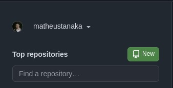
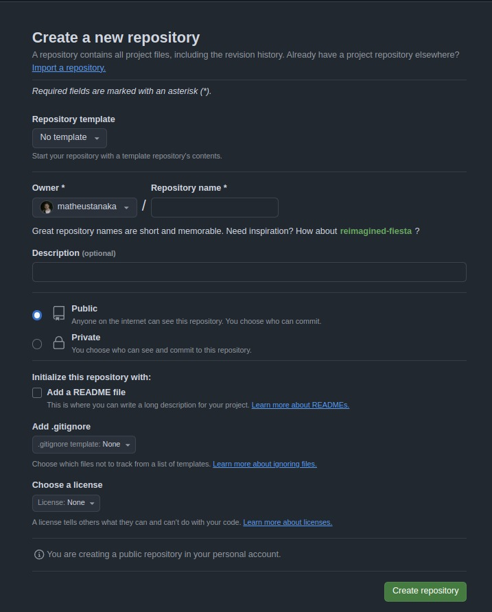
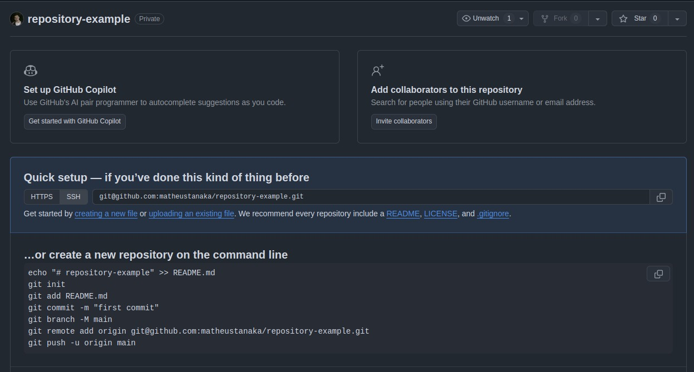

# Comandos do git

O git possui diversos comandos para diversas funcionalidades, mas inicialmente, nós vamos cobrir só algumas funcionalidades.

# Comandos e suas funcionalidades

```shell
# Utilizado para inicializar o seu repositório
git init

# Utilizado para adicionar suas mudancas
git add

# Utilizado para salvar suas mudancas
git commit

# Utilizado para exibir o histórico de commits
git log

# Utilizado para verificar as mudancas feitas nos arquivos/diretório do projeto
git status

# Utilizado para se conectar a um repositório na nuvem
git remote add origin https://github.com/seuusuario/meu_projeto.git

# Utilizado para enviar seus commits locais para a nuvem
git push

# Utilizado para atualizar o repositório local com as mudancas que estão na nuvem
git pull

# Cria uma copia local de um repositório existente na nuvem. Este comando copia todos os arquivos/historico de commits do repositorio remoto para sua maquina local
git clone <url-repositorio>
```

# Criando um repositório Local

```shell
# Criando uma pasta chamada de ecac-git
mkdir ecac-git

# Entrando dentro da pasta
cd ecac-git

# Verificando o caminho da sua pasta
pwd

# Inicializando seu repositório Local
git init
```

# Criando um arquivo no seu repositório Local

```shell
echo "# Olá mundo" > README.md
```

# Adicionando o arquivo ao repositório

```shell
git add README.md
```

# Salvando o arquivo no repositório local

```shell
# -m adiciona uma mensagem ao seu commit
git commit -m "Meu primeiro commit no ECAC"
```

# Criar um repositório na nuvem e subir o seu arquivo para o GitHub

### Como criar um repositório na nuvem

Na home page do Github, na sidebar do lado esquerda tem um botão verde como na imagem abaixo.
Selecione este botão:



Insira os dados do seu repositório e clique em "Create repository"



Com o repositório criado, você pode seguir as instrucões que estão no repositório para adicionar o seu conteúdo local para o repositório remoto (nuvem)



### Subindo os arquivos para a nuvem (repositório na nuvem)

```sh
# Cria um arquivo Readme.md com o título de # repository-example
echo "# repository-example" >> README.md
# Inicializa o repositório
git init
# Adiciona o README ao repositório
git add README.md
# Adiciona uma mensagem ao seu commit
git commit -m "first commit"
# Define a branch do seu repositório
git branch -M main
# Faz o "link" do seu repositório local com a nuvem, desta forma, qualquer alteracão local que você realizar, poderá ser adicionada a nuvem (repositório remoto)
git remote add origin git@github.com:matheustanaka/repository-example.git # Lembre-se de alterar este comando pelo o que for gerado pelo Github quando você criar seu repositório
# Sobe as alteracões locais para a nuvem (repositório remoto)
git push -u origin main
```


